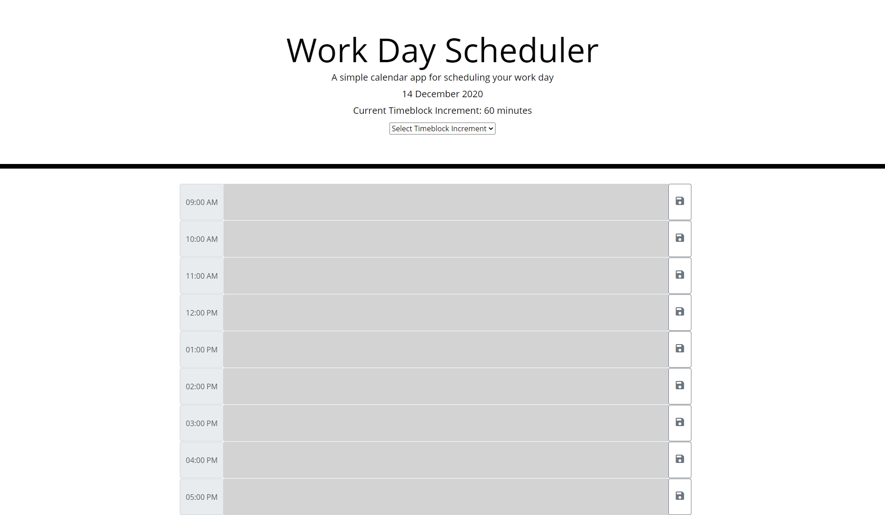

# workday-schedule-jasibal

## Description

A javascript project of a workday schedule. Allows the user to save events for each hour of the day. This app runs in the browser and features dynamically updated HTML and CSS.

## Links

[Work Day Scheduler](https://vicryt8.github.io/workday-schedule-jasibal/)

## Screenshots

### Work Day Scheduler

